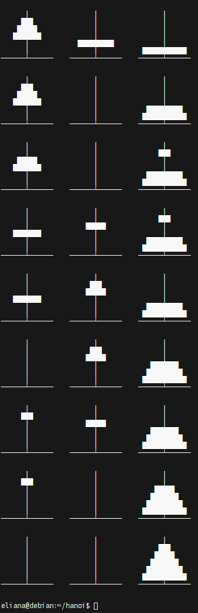

# Towers of Hanoi

Pretty-print the series of moves in a [Tower of Hanoi](https://en.wikipedia.org/wiki/Tower_of_Hanoi) game with n disks using x86-64 Assembly.

Here's the end of the 5 disk solution (but can be used for up to 32 disks, if you're willing to wait...):


Done hastily as a small program written from scratch for the RC application.


### To run
Clone the repository, then just: ``` ./hanoi ``` (must be run on Linux with a Haswell or newer processor).

If you want to change the number of disks, you have to edit the asm and re-assemble it with fasm.

TODO: ```Makefile```; command-line argument for n (instead of assemble-time)

### Reasoning

I remembered this as a fun puzzle, and when I looked at the Wikipedia page and saw a ["binary algorithm"](https://en.m.wikipedia.org/wiki/Tower_of_Hanoi#Binary_solution) for the optimal solution, I thought the algorithm would be super cute in Assembly. Also, doing something in assembly is a bit of a joke about writing the program "from scratch."
